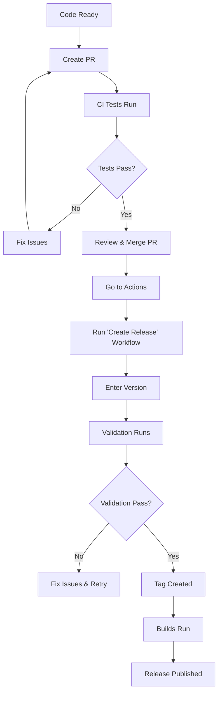

# Release Strategies for Gopher

This document explains the different release methods available and when to use each.

---

## 🎯 **Three Ways to Release**

### **Method 1: Manual GitHub Release Button**

**How it works:**
1. Go to https://github.com/molmedoz/gopher/releases
2. Click "Draft a new release"
3. Choose tag, write notes, upload binaries manually
4. Click "Publish release"

**When to use:**
- ❌ **NOT RECOMMENDED** - Too manual, error-prone

**Pros:**
- Simple UI

**Cons:**
- ❌ Must build binaries manually
- ❌ Must upload each file manually
- ❌ No automated testing
- ❌ No validation before release
- ❌ Time-consuming and error-prone

---

### **Method 2: Push Tag (Current)**

**How it works:**
```bash
# Locally
git tag -a v1.0.0 -m "Release v1.0.0"
git push origin v1.0.0

# GitHub Actions automatically:
# - Builds binaries
# - Runs GoReleaser
# - Creates release
```

**When to use:**
- ✅ When you're confident everything is ready
- ✅ For quick releases
- ✅ When you've already run `make ci` locally

**Pros:**
- ✅ Fast and simple
- ✅ Automated builds
- ✅ Uses GoReleaser

**Cons:**
- ⚠️ Tag created BEFORE validation
- ⚠️ If builds fail, must delete tag manually
- ⚠️ No pre-flight checks

**Workflow:**
```bash
# 1. Ensure you're on master
git checkout master
git pull origin master

# 2. Run local checks
make ci

# 3. Create and push tag
make create-tag TAG=v1.0.0

# 4. Monitor GitHub Actions
# Check: https://github.com/molmedoz/gopher/actions
```

---

### **Method 3: Manual Release Workflow (NEW - RECOMMENDED)** ⭐

**How it works:**
1. Go to Actions → "Create Release"
2. Click "Run workflow"
3. Enter version (e.g., "1.0.0")
4. Choose options (draft/prerelease)
5. Click "Run workflow"

**The workflow automatically:**
1. ✅ Validates version format
2. ✅ Checks if tag already exists
3. ✅ Verifies CHANGELOG.md has the version
4. ✅ Runs all tests with race detection
5. ✅ Runs linter
6. ✅ Builds for all platforms
7. ✅ Creates tag (only if validation passes)
8. ✅ Runs GoReleaser
9. ✅ Extracts release notes from CHANGELOG
10. ✅ Publishes release

**When to use:**
- ✅ **RECOMMENDED for v1.0.0 and future releases**
- ✅ When you want full validation before tagging
- ✅ When releasing from GitHub UI

**Pros:**
- ✅ Complete validation before tagging
- ✅ No tag created if validation fails
- ✅ Can create draft releases first
- ✅ Automatic CHANGELOG extraction
- ✅ Manual control with automation
- ✅ Safe and reliable

**Cons:**
- ⚠️ Requires GitHub UI interaction
- ⚠️ Can't be fully scripted locally

**Workflow:**
```
1. Go to: https://github.com/molmedoz/gopher/actions/workflows/create-release.yml
2. Click "Run workflow"
3. Enter version: 1.0.0
4. Select options:
   - Pre-release: No
   - Draft: No (or Yes to review first)
5. Click "Run workflow"
6. Watch it validate, test, build, tag, and release!
```

---

## **Comparison Matrix:**

| Feature | Manual Button | Push Tag | Workflow Dispatch |
|---------|---------------|----------|-------------------|
| **Validation** | ❌ None | ⚠️ Local only | ✅ Full automated |
| **Testing** | ❌ Manual | ⚠️ After tag | ✅ Before tag |
| **Tag Creation** | ✅ Automatic | ⚠️ Before validation | ✅ After validation |
| **Builds** | ❌ Manual | ✅ Automated | ✅ Automated |
| **Release Notes** | ❌ Manual entry | ⚠️ Manual/GoReleaser | ✅ From CHANGELOG |
| **Rollback** | ❌ Hard | ❌ Hard | ✅ Easy |
| **Safety** | ❌ Low | ⚠️ Medium | ✅ High |
| **Speed** | ❌ Slow | ✅ Fast | ⚠️ Medium |

---

## **🎯 Recommended Strategy:**

### **For v1.0.0 (First Release):**
Use **Method 3 (workflow_dispatch)** for maximum safety:

```
1. Merge PR to master
2. Go to Actions → "Create Release"
3. Run workflow with version: 1.0.0
4. Watch validation, testing, building
5. Release published automatically!
```

### **For Future Releases (v1.1.0+):**
Either:
- **Method 3** (safest - validates before tagging)
- **Method 2** (faster - if you're confident)

---

## **Advanced: Version from CHANGELOG** 

The new workflow (`create-release.yml`) automatically:

### **1. Extracts Release Notes from CHANGELOG.md**
```bash
# Finds this section:
## [1.0.0] - 2025-10-15

### Added
- Features...

### Fixed
- Bugs...

# And uses it for GitHub Release notes
```

### **2. Validates Version Exists**
```bash
# Checks CHANGELOG.md has the version
# Warns if not found (doesn't fail)
```

### **Could Auto-Detect Version?**

**Yes! But not recommended because:**
- Multiple versions might exist in CHANGELOG
- Which one to release?
- Manual input ensures intentionality
- Prevents accidental releases

**However, if you want it:**
```yaml
# Auto-detect latest version from CHANGELOG
version=$(grep -oP "## \[\K[0-9]+\.[0-9]+\.[0-9]+" CHANGELOG.md | head -1)
```

---

## **Why Docker Tests Run Independently:**

### **Purpose of Docker Tests:**
```yaml
# docker.yml - Optional E2E testing
on:
  workflow_dispatch:  # Manual trigger
  push:
    branches: [develop]  # Only on dev branch
```

**Reasons for Independence:**

1. **Speed**: Docker builds are slow (1-5 minutes each)
   - Main CI: ~2-3 minutes
   - With Docker: ~10-15 minutes
   
2. **Purpose**: Development tool, not release requirement
   - Tests in isolated environments
   - Simulates different OS scenarios
   - Used during development/debugging

3. **Release Uses Native Runners**:
   - GoReleaser builds on native OS
   - CI tests on actual Windows/Linux/macOS
   - Docker simulation not needed

4. **Flexibility**:
   - Run when needed
   - Don't slow down every commit
   - Can be triggered manually

---

## **Complete Release Flow (Recommended):**



**Steps:**
1. **Merge PR** → master (code validated)
2. **Go to Actions** → "Create Release" workflow
3. **Click "Run workflow"**
4. **Enter version**: 1.0.0
5. **Watch it work**:
   - ✅ Validate version
   - ✅ Check tag doesn't exist
   - ✅ Run tests
   - ✅ Run linter
   - ✅ Build all platforms
   - ✅ Create tag
   - ✅ Run GoReleaser
   - ✅ Publish release

---

## **How to Use the New Workflow:**

### **Via GitHub UI (Easiest):**
```
1. Go to: https://github.com/molmedoz/gopher/actions/workflows/create-release.yml
2. Click "Run workflow" button
3. Fill in:
   - Branch: master
   - Version: 1.0.0
   - Pre-release: ☐ No
   - Draft: ☐ No (or ☑ Yes to review first)
4. Click "Run workflow"
5. Done! ✅
```

### **Via GitHub CLI (Scriptable):**
```bash
gh workflow run create-release.yml \
  --ref master \
  -f version=1.0.0 \
  -f prerelease=false \
  -f draft=false
```

### **Via API (Advanced):**
```bash
curl -X POST \
  -H "Authorization: token $GITHUB_TOKEN" \
  -H "Accept: application/vnd.github.v3+json" \
  https://api.github.com/repos/molmedoz/gopher/actions/workflows/create-release.yml/dispatches \
  -d '{"ref":"master","inputs":{"version":"1.0.0","prerelease":"false","draft":"false"}}'
```

---

## **Benefits of This Approach:**

### **Safety:**
- ✅ Tag created AFTER validation
- ✅ If tests fail, no tag created
- ✅ Can't release broken code
- ✅ Automatic rollback if issues

### **Convenience:**
- ✅ One-click release from GitHub
- ✅ No local git commands needed
- ✅ Release notes auto-extracted
- ✅ Full visibility in Actions UI

### **Flexibility:**
- ✅ Can create drafts first
- ✅ Can mark as pre-release
- ✅ Manual approval points
- ✅ Complete audit trail

---

## **Comparison: Methods 2 vs 3**

### **Method 2: Push Tag (Old Way)**
```bash
make ci                    # Local validation
make create-tag TAG=v1.0.0 # Creates tag
# ❌ If GitHub Actions fails, tag already exists!
```

### **Method 3: Workflow Dispatch (New Way)**
```
GitHub UI → Run workflow → Enter version
# ✅ Validates first
# ✅ Then creates tag
# ✅ Then builds
# ❌ If anything fails, no tag created!
```

---

## **Recommendation for Gopher:**

### **v1.0.0 Release:**
Use **Method 3** (create-release.yml workflow):
1. Merge PR to master
2. Use GitHub Actions → "Create Release"
3. Enter version, click run
4. Let automation handle everything

### **Future Releases:**
Continue using **Method 3** because:
- Safer (validates before tagging)
- Easier (no local commands)
- More reliable (consistent process)
- Better visibility (all in GitHub UI)

---

## **Quick Reference:**

```bash
# Old way (Method 2):
git tag -a v1.0.0 -m "Release v1.0.0"
git push origin v1.0.0
# ⚠️ Tag exists even if builds fail

# New way (Method 3):
# Go to GitHub Actions UI
# Run "Create Release" workflow
# Enter: 1.0.0
# ✅ Tag only created if validation passes
```

---

**The new `create-release.yml` workflow is now ready to use! This is the safest and most reliable way to release Gopher.** 🎉

